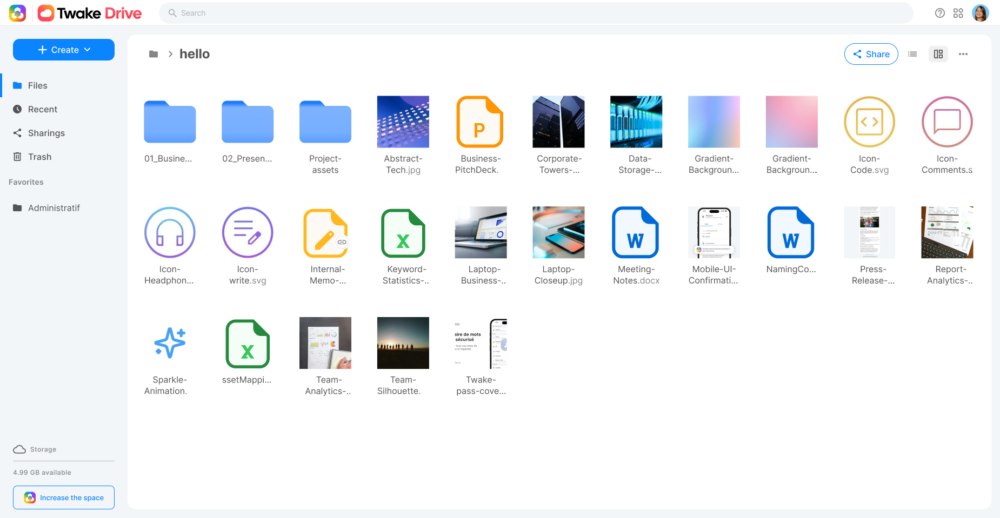

# Twake Drive

<p align="center">
  <a href="https://github.com/linagora/twake-drive">
   
   
  </a>
  <p align="center">
    <b align="center">The open-source alternative to Google Drive.</b>
    <br />
    <a href="https://twake.app"><strong>Learn more »</strong></a>
    <br />
    <br />
    <a href="https://twake-drive.com">Website</a>
    |
    <a href="https://github.com/linagora/twake-drive/issues">Issues</a>
  </p>
</p>

## About



## What's Drive?

Twake Drive makes your file management easy. Main features are:

- File tree
- Files and folders upload.
- Files and folders sharing (via URLs)
- Files and folders search

## Getting Started

_:pushpin: Note:_ [Yarn] is the official Node package manager of Twake Drive. Don't hesitate to [install Yarn][yarn-install]

### Install

Starting the Drive app requires you to [setup a dev environment][setup].

You can then clone the app repository and install dependencies:

```sh
$ git clone https://github.com/linagora/twake-drive.git
$ cd twake-drive
$ yarn install
```

:pushpin: Don't forget to set the local node version indicated in the `.nvmrc` before doing a `yarn install`.

Twake Drive use a standard set of _npm scripts_ to run common tasks, like watch, lint, test, build…

### Run in dev mode

Using a watcher - with Hot Module Replacement:

```sh
$ cd twake-drive
$ yarn watch
$ cozy-stack serve --appdir drive:/<project_absolute_path>/twake-drive/build/drive --disable-csp
```

Or directly build the app (static file generated):

```sh
$ cd twake-drive
$ yarn build
$ cozy-stack serve --appdir drive:/<project_absolute_path>/twake-drive/build/drive
```

Your app is available at http://drive.cozy.localhost:8080/#/folder

Note: it's mandatory to explicit to cozy-stack the folder of the build that should be served, to be able to run the app.

### Run it inside the VM

You can view your current running app, you can use the [cozy-stack docker image][cozy-stack-docker]:

```sh
# in a terminal, run your app in watch mode
$ cd twake-drive
$ yarn watch
```

```sh
# in another terminal, run the docker container
$ docker run --rm -it -p 8080:8080 -v "$(pwd)/build/drive":/data/cozy-app/drive cozy/cozy-app-dev
```

Your app is available at http://drive.cozy.tools:8080.

## Advanced case

### Share and send mails in development

Twake Drive let users [share documents from twake to twake](https://github.com/cozy/cozy-stack/blob/master/docs/sharing.md#cozy-to-cozy-sharing).

Meet Alice and Bob.
Alice wants to share a folder with Bob.
Alice clicks on the share button and fills in the email input with Bob's email address.
Bob receives an email with a _« Accept the sharing »_ button.
Bob clicks on that button and is redirected to Alice's twake to enter his own twake url to link both twakes.
Bob sees Alice's shared folder in his own twake.

🤔 But how could we do this scenario on binary cozy-stack development environment?

If you develop with the [cozy-stack CLI](https://github.com/cozy/cozy-stack/blob/master/docs/cli/cozy-stack.md), you have to run [MailHog](https://github.com/mailhog/MailHog) on your computer and tell `cozy-stack serve` where to find the mail server with some [options](https://github.com/cozy/cozy-stack/blob/master/docs/cli/cozy-stack_serve.md#options):

```
./cozy-stack serve --appdir drive:../twake-drive/build --mail-disable-tls --mail-port 1025
```

_This commands assumes you `git clone` [twake-drive](https://github.com/linagora/twake-drive) in the same folder than you `git clone` [cozy-stack](https://github.com/cozy/cozy-stack)._

Then simply run `mailhog` and open http://cozy.tools:8025/.

#### Retrieve sent emails

With MailHog, **every email** sent by cozy-stack is caught. That means the email address _does not have to be a real one_, ie. `bob@cozy`, `bob@cozy.tools` are perfectly fine. It _could be a real one_, but the email will not reach the real recipient's inbox, say `contact@cozycloud.cc`.

### Living on the edge

[Cozy-ui] is our frontend stack library that provides common styles and components accross the whole Twake React apps. You can use it for you own application to follow the official Twake's guidelines and styles. If you need to develop / hack cozy-ui, it's sometimes more useful to develop on it through another app. You can do it by cloning cozy-ui locally and link it to yarn local index:

```sh
git clone https://github.com/cozy/cozy-ui.git
cd cozy-ui
yarn install
yarn link
```

then go back to your app project and replace the distributed cozy-ui module with the linked one:

```sh
cd twake-drive
yarn link cozy-ui
```

You can now run the watch task and your project will hot-reload each times a cozy-ui source file is touched.

###### Troubleshooting

Consider using [rlink] instead of `yarn link`

[Cozy-client] is our API library that provides an unified API on top of the cozy-stack. If you need to develop / hack cozy-client in parallel of your application, you can use the same trick that we used with [cozy-ui]: yarn linking.

### Tests

Tests are run by [jest] under the hood, and written using [chai] and [sinon]. You can easily run the tests suite with:

```sh
$ cd twake-drive
$ yarn test
```

:pushpin: Don't forget to update / create new tests when you contribute to code to keep the app the consistent.

### Open a Pull-Request

If you want to work on Drive and submit code modifications, feel free to open pull-requests! See the [contributing guide][contribute] for more information about how to properly open pull-requests.

## Community

### Localization

Localization and translations are handled by [Transifex][tx].

As a _translator_, you can login to [Transifex][tx-signin] (using your Github account) and claim access to the [app repository][tx-app]. Locales are pulled [by the pipeline][yarn tx in travis.yml] when app is build before publishing.

As a _developer_, you must configure the [Transifex CLI][tx-cli], and claim access as _maintainer_ to the [app repository][tx-app]. Then please **only update** the source locale file (usually `en.json` in client and/or server parts), and push it to Transifex repository using the `tx push -s` command.

If you were using a [transifex-client](tx-client), you must move to [Transifex CLI](tx-cli) to be compatible with the v3 API.

The transifex configuration file is still in an old version. Please use the previous client for the moment [https://github.com/transifex/transifex-client/](https://github.com/transifex/transifex-client/).

## License

Twake Drive is developed by Linagora and distributed under the [AGPL v3 license][agpl-3.0].

[cozy]: https://cozy.io 'Cozy Cloud'
[setup]: https://docs.cozy.io/en/tutorials/app/#install-the-development-environment 'Cozy dev docs: Set up the Development Environment'
[yarn]: https://yarnpkg.com/
[yarn-install]: https://yarnpkg.com/en/docs/install
[cozy-ui]: https://github.com/cozy/cozy-ui
[rlink]: https://gist.github.com/ptbrowne/add609bdcf4396d32072acc4674fff23
[cozy-client]: https://github.com/cozy/cozy-client/
[cozy-stack-docker]: https://github.com/cozy/cozy-stack/blob/master/docs/client-app-dev.md#with-docker
[doctypes]: https://cozy.github.io/cozy-doctypes/
[bill-doctype]: https://github.com/cozy/cozy-konnector-libs/blob/master/models/bill.js
[konnector-doctype]: https://github.com/cozy/cozy-konnector-libs/blob/master/models/base_model.js
[konnectors]: https://github.com/cozy/cozy-konnector-libs
[agpl-3.0]: https://www.gnu.org/licenses/agpl-3.0.html
[contribute]: CONTRIBUTING.md
[tx]: https://www.transifex.com/cozy/
[tx-signin]: https://www.transifex.com/signin/
[tx-app]: https://www.transifex.com/cozy/cozy-drive/dashboard/
[tx-translate]: https://www.transifex.com/cozy/cozy-drive/translate/
[tx-cli]: https://developers.transifex.com/docs/cli
[tx-client]: https://github.com/transifex/transifex-client
[libera]: https://web.libera.chat/#cozycloud
[forum]: https://forum.cozy.io/
[github]: https://github.com/cozy/
[twitter]: https://twitter.com/linagora
[nvm]: https://github.com/creationix/nvm
[cozy-dev]: https://github.com/cozy/cozy-dev/
[jest]: https://jestjs.io/fr/
[chai]: http://chaijs.com/
[sinon]: http://sinonjs.org/
[checkbox]: https://help.github.com/articles/basic-writing-and-formatting-syntax/#task-lists
[yarn tx in travis.yml]: .travis.yml#L41
